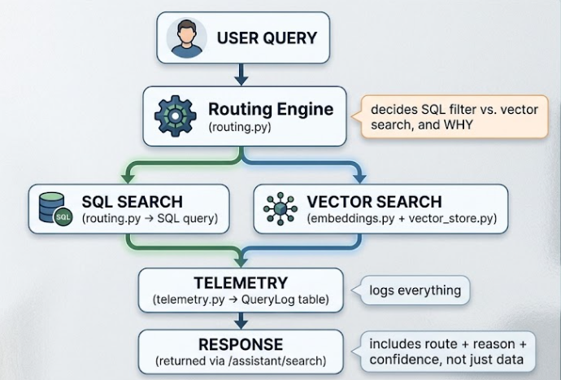

# AI trust &amp; metrics framework

Extends `trust-and-reliability-framework.md` with concrete formulas, worked
examples, and an honest current-vs-planned status for each metric. This is
what turns "we log some stuff" into a measurable, auditable standard.

## Architecture



The routing engine's decision (SQL vs. vector) is the fork every metric
below hangs off of — which path a query took determines its cost, its
latency profile, and which validation method even applies to it.

---

## Layer 1 — Reliability metrics
**Question they answer**: did the AI system work at all?

| Metric | Formula | Worked example |
|---|---|---|
| Success rate | successful queries / total queries | 980 / 1000 = **98%** |
| Error rate | errors / total queries | 20 / 1000 = **2%** |
| Uptime | time available / total time | **99.9%** (enterprise target: 99.95%+) |

**Status**: `success` and `error` are already columns on `QueryLog`
(`telemetry.py`) — success rate and error rate are queryable today with a
single SQL aggregate. Uptime is not yet tracked; it requires the health
checks from Day 1 to be polled and logged over time, not just checked
on-demand. **Planned for**: Day 13 (testing/optimization), where a
lightweight uptime poller is a natural fit.

---

## Layer 2 — Observability metrics
**Question they answer**: what is actually happening inside the system?

**Latency** — already fully implemented. Every `/assistant/search` call
records `latency_ms` via `telemetry.timed()`.
```json
{"query": "waterproof hiking boots", "latency_ms": 50}
```

**Route distribution** — how many queries went SQL vs. AI:
```
SQL route = 850, AI route = 150
→ 85% SQL, 15% AI
```
This number matters more than it looks — every point of it is a direct
cost signal, since AI-path queries are the only ones with any real compute
cost. **Status**: fully queryable today — `path` is logged on every row of
`QueryLog`.

**Query volume** — total queries per day/hour, useful for scaling
decisions. **Status**: trivially derivable from `QueryLog` row counts;
no dashboard yet (see Layer 5).

---

## Layer 3 — Validation metrics
**Question they answer**: was the answer actually *good*? This is the layer
most AI projects skip, and the one that matters most.

**Precision** — of what was returned, how much was actually relevant:
```
Query: "waterproof hiking boots"
Returned: 10 products, 8 relevant
Precision = 8 / 10 = 80%
```

**Recall** — of what should have been returned, how much was found:
```
20 relevant boots exist in the catalog, 8 were returned
Recall = 8 / 20 = 40%
```
Enterprise target: high precision *and* high recall — a system can look
accurate while badly under-returning relevant results, which precision
alone won't catch.

**Status**: not yet implemented. `result_count` is logged today, but *not*
whether those results were actually correct — that requires either a
labeled test set (this is exactly what Day 9's 10-query integration test
is for) or user feedback capture, which isn't built yet. **This is the
most important gap to close before calling the system "validated."**

---

## Layer 4 — Governance metrics
**Question they answer**: can this system be trusted and audited after
the fact?

**Explainability** — a bare path is not an explanation:
```json
// Before: {"path": "filter"}
// After:  {"path": "filter", "reason": "Matched category + price + waterproof"}
```
**Status**: implemented as of today's `routing.py` update — every decision
now carries a `reason` string.

**Traceability** — every query needs a stable ID to follow it through
routing → results → any later user feedback:
```json
{"query_id": "abc123"}
```
**Status**: not yet implemented. `QueryLog.id` exists as an auto-increment
primary key, but there's no UUID exposed in the API response for a client
or log aggregator to correlate against. **Small addition, worth doing
soon** — a one-line change to generate and return a UUID per request.

**Auditability** — timestamped, immutable record of what happened:
```json
{"timestamp": "2026-08-11", "query": "gift for hikers", "route": "ai"}
```
**Status**: implemented — `QueryLog.timestamp` is set server-side on every
insert.

---

## Layer 5 — Business metrics
**Question they answer**: is this actually helping the business?

**Cost per query**:
```
Vendor bill / total queries = cost per query
```
For this project specifically, the honest number is close to **$0.00** —
local Ollama inference has no per-token vendor cost. The metric still
matters because it's the number that would matter immediately if this were
migrated to a paid API, and tracking query volume today means that
migration cost is already predictable.

**AI avoidance rate** — the metric that most directly proves out the
hybrid architecture's cost thesis:
```
SQL queries / total queries
850 / 1000 = 85% avoided AI-path cost entirely
```
**Status**: fully computable today from `QueryLog.path` — this is
arguably the single most demonstrable number from the whole project, and
worth leading with in the case study.

---

## The logging standard — target shape

Every query should ultimately log this full shape:
```json
{
  "query_id": "uuid",
  "query": "waterproof hiking boots",
  "route": "filter",
  "reason": "category+price+waterproof",
  "confidence": 0.9,
  "latency_ms": 18,
  "result_count": 2,
  "timestamp": "..."
}
```

| Field | Status |
|---|---|
| `query` | ✅ logged |
| `route` (`path`) | ✅ logged |
| `reason` | ✅ logged (added today) |
| `confidence` | ✅ logged (added today) |
| `latency_ms` | ✅ logged |
| `result_count` | ✅ logged |
| `timestamp` | ✅ logged |
| `query_id` | ⬜ not yet — small addition |
| validation label (was the result correct) | ⬜ not yet — needs Day 9 test set or feedback capture |
| `hallucination_rate` | ⬜ not yet — needs the agent (Day 7+) and its groundedness check |

---

## Dashboard vision (future, not required for this build)

```
Queries Today           12,430
Success Rate            99.2%
Average Latency         42ms
SQL Route                 83%
AI Route                  17%
AI Avoidance Rate         83%
Cost Per Query          $0.002
Hallucination Rate        1.3%
Top Searches       Hiking Boots
Failed Searches            24
```

Every number above is either already computable from `QueryLog` today, or
has a clearly identified day in the plan where it becomes computable. None
of it requires new infrastructure beyond what's already running — a
Streamlit view over the existing SQLite table (the same pattern as Control
Hub, scaled down) is the natural "if I had one more day" extension.

---

## What this document changes about the project

This is the difference between building **an AI assistant** and building
**a trustworthy AI platform**: reliability, observability, governance, and
validation aren't separate from the feature — they're logged alongside
every single query, from the first request onward, with an explicit,
honest accounting of what's measured today versus what's planned.
